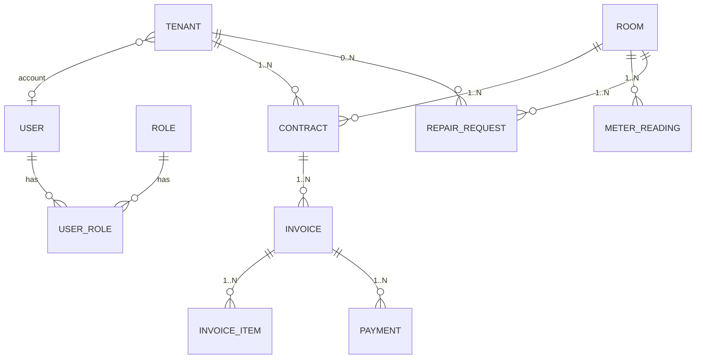
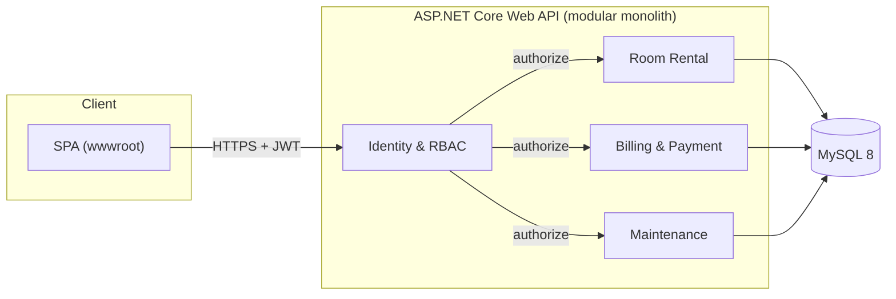
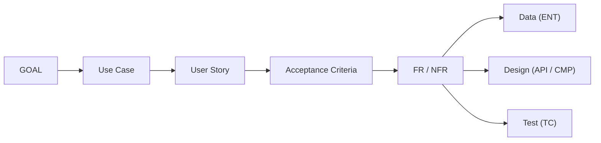

**PHÂN TÍCH & THIẾT KẾ  
HỆ THỐNG THÔNG TIN**

Use Case · User Story · Requirements · Domain Data · System Design

| **Trường thông tin** | **Nội dung**                                       |
| -------------------- | -------------------------------------------------- |
| Tên dự án / hệ thống | HỆ THỐNG QUẢN LÝ PHÒNG TRỌ VÀ THANH TOÁN TIỀN THUÊ |
| Đơn vị / khách hàng  | HỌC PHẦN LẬP TRÌNH WEB NÂNG CAO                    |
| Nhóm thực hiện       | NGUYỄN TIẾN DŨNG – TRẦN PHONG – NGUYỄN NGỌC TUẤN   |
| Phiên bản tài liệu   | v1.1 – Cập nhật sau phản biện (bổ sung ADR, threat model, RBAC) |
| Ngày cập nhật        | 23/09/2026                                         |
| Trạng thái           | In Review                                          |

# 0\. Quy ước tài liệu

Tài liệu dùng mã định danh để truy vết hai chiều giữa yêu cầu, dữ liệu, thiết kế và kiểm chứng. Các bảng quy ước dưới đây áp dụng nhất quán cho toàn tài liệu.

## 0.1 Quy ước mã định danh

| **Tiền tố** | **Đối tượng**                | **Ví dụ**   |
| ----------- | ---------------------------- | ----------- |
| GOAL-       | Mục tiêu nghiệp vụ           | GOAL-01     |
| ACT-        | Actor / stakeholder          | ACT-01      |
| UC-         | Use Case                     | UC-01       |
| US-         | User Story                   | US-001      |
| AC-         | Acceptance Criterion         | US-24/AC-01 |
| FR-         | Functional Requirement       | FR-001      |
| NFR-        | Non-Functional Requirement   | NFR-PERF-01 |
| BR-         | Business Rule                | BR-01       |
| ENT-        | Domain Entity / Aggregate    | ENT-01      |
| API-        | API endpoint / contract      | API-01      |
| CMP-        | Component                    | CMP-01      |
| ADR-        | Architecture Decision Record | ADR-01      |
| TC-         | Test Case                    | TC-001      |

## 0.2 Trạng thái và mức ưu tiên

| **Thuộc tính** | **Giá trị khuyến nghị**                                        | **Ý nghĩa**                      |
| -------------- | -------------------------------------------------------------- | -------------------------------- |
| Status         | Draft / Ready / Approved / Implemented / Verified / Deprecated | Vòng đời của artefact            |
| Priority       | Must / Should / Could / Won't (this release)                   | Phạm vi phát hành                |
| Risk           | Low / Medium / High / Critical                                 | Mức ảnh hưởng nếu sai hoặc thiếu |
| Owner          | Tên người / vai trò                                            | Người chịu trách nhiệm cập nhật  |

# 1\. Bối cảnh, mục tiêu và phạm vi

## 1.1 Tóm tắt điều hành

**Vấn đề cần giải quyết**

Hoạt động quản lý phòng trọ hiện nay có thể được thực hiện bằng sổ sách, bảng tính hoặc nhiều công cụ rời rạc. Việc quản lý thông tin phòng, người thuê, hợp đồng, chỉ số điện nước, tiền thuê và các yêu cầu sửa chữa dễ dẫn đến sai sót, khó tra cứu lịch sử và mất nhiều thời gian tổng hợp.

Chủ trọ cần một hệ thống tập trung để theo dõi tình trạng phòng, người thuê, hợp đồng và các khoản phải thu. Người thuê cần có khả năng xem thông tin hợp đồng, hóa đơn và gửi yêu cầu hỗ trợ mà không phải trao đổi thủ công nhiều lần.

**Giá trị kỳ vọng**

Hệ thống giúp tập trung dữ liệu quản lý phòng trọ, giảm thao tác thủ công, hạn chế sai sót khi lập hóa đơn và hỗ trợ người thuê tra cứu thông tin nhanh chóng.

Mục tiêu phiên bản đầu là quản lý được toàn bộ vòng đời cơ bản của **phòng → người thuê → hợp đồng → điện nước → hóa đơn → thanh toán**, đồng thời kiểm soát quyền truy cập bằng JWT và phân quyền theo vai trò.

**Giải pháp ở mức khái niệm**

Hệ thống cung cấp một ứng dụng web cho phép chủ trọ quản lý phòng, người thuê, hợp đồng, chỉ số điện nước, hóa đơn và thanh toán. Người thuê có tài khoản để xem thông tin cá nhân, hợp đồng, hóa đơn và gửi yêu cầu sửa chữa. Quản trị viên quản lý tài khoản và các thiết lập chung của hệ thống. Người dùng đăng nhập để nhận JWT; các API được bảo vệ sẽ kiểm tra token và quyền trước khi cho phép thực hiện nghiệp vụ.

## 1.2 Mục tiêu và chỉ số thành công

**ID**

**Mục tiêu**

**Chỉ số / Baseline**

**Target**

**Thời hạn**

**Owner**

GOAL-01

Quản lý tập trung phòng, người thuê và hợp đồng

Dữ liệu quản lý rời rạc

100% phòng và hợp đồng trong phạm vi hệ thống được quản lý tập trung

Release 1

Nhóm SV

GOAL-02

Quản lý chính xác tiền thuê, điện nước và hóa đơn

Tính toán thủ công

Hóa đơn được tạo từ dữ liệu hợp đồng và chỉ số điện nước; không tạo trùng kỳ

Release 1

Nhóm SV

GOAL-03

Kiểm soát truy cập bằng xác thực và phân quyền

Chưa có cơ chế tập trung

100% API nhạy cảm yêu cầu JWT và vai trò phù hợp

Release 1

Nhóm SV

GOAL-04

Hỗ trợ người thuê tra cứu và gửi yêu cầu

Trao đổi thủ công

Người thuê có thể xem hóa đơn/hợp đồng và gửi yêu cầu trực tuyến

Release 1

Nhóm SV

## 1.3 Phạm vi

**In scope**

**Out of scope**

**Giả định**

**Ràng buộc**

Đăng ký/đăng nhập

Thanh toán qua ngân hàng thực tế

Mỗi người thuê có một tài khoản

ASP.NET Core

JWT Authentication

Tích hợp VNPay/MoMo

Email/username là duy nhất

Database không dùng SQLite

Phân quyền Admin/Chủ trọ/Người thuê

OTP SMS

Một phòng có thể có một hoặc nhiều người thuê theo hợp đồng

MySQL

Quản lý phòng

Quản lý nhiều công ty/tenant độc lập

Chủ trọ chịu trách nhiệm cập nhật dữ liệu

REST API

Quản lý người thuê

Kế toán chuyên nghiệp

Chỉ số điện nước được nhập thủ công

Postman

Quản lý hợp đồng

AI chatbot

Giá điện/nước do chủ trọ cấu hình

JWT

Quản lý điện/nước

Tích hợp IoT đồng hồ điện nước

Thanh toán được ghi nhận thủ công

Frontend tùy chọn

Tạo/quản lý hóa đơn

Gửi SMS tự động

Dữ liệu phục vụ mục đích học tập

Thời gian thực hiện giới hạn

Ghi nhận thanh toán

Ứng dụng mobile native

Hệ thống triển khai dạng modular monolith

Nhóm 3 người n

Gửi/xử lý yêu cầu sửa chữa

Hệ thống quản lý tài sản lớn

Xem lịch sử

## 1.4 Bên liên quan

| **ID** | **Bên liên quan**      | **Mục tiêu / mối quan tâm**                                                     | **Quyền quyết định** | **Kênh tham gia**             |
| ------ | ---------------------- | ------------------------------------------------------------------------------- | -------------------- | ----------------------------- |
| ACT-01 | Quản trị viên hệ thống | Quản lý tài khoản, vai trò và quyền truy cập                                    | Approve / Operate    | Demo / Review                 |
| ACT-02 | Chủ trọ                | Quản lý phòng, người thuê, hợp đồng, điện nước, hóa đơn, thanh toán và sửa chữa | Approve / Operate    | Interview / Workshop / Review |
| ACT-03 | Người thuê             | Tra cứu hợp đồng, hóa đơn, thanh toán và gửi yêu cầu sửa chữa                   | Consult / Feedback   | Usability test / Demo         |
| ACT-04 | Nhóm phát triển        | Thiết kế, triển khai, kiểm thử và vận hành hệ thống                             | Design / Implement   | Code review / Demo            |

## 1.5 Thuật ngữ nghiệp vụ

| **Thuật ngữ**    | **Định nghĩa duy nhất**                                                                               | **Từ đồng nghĩa cần tránh** | **Nguồn / Owner** |
| ---------------- | ----------------------------------------------------------------------------------------------------- | --------------------------- | ----------------- |
| Phòng trọ        | Đơn vị chỗ ở được quản lý, có mã/số phòng, giá thuê và trạng thái sử dụng                             | Căn phòng                   | ACT-02 / Nhóm SV  |
| Hợp đồng thuê    | Thỏa thuận giữa chủ trọ và một hoặc nhiều người thuê về việc sử dụng phòng trong một khoảng thời gian | Đơn thuê                    | ACT-02            |
| Chỉ số điện nước | Số điện và số nước được ghi nhận tại thời điểm chốt kỳ để tính mức tiêu thụ                           | Công tơ / số đo             | ACT-02            |
| Hóa đơn          | Khoản phải thu của một phòng trong một kỳ, gồm tiền phòng, điện, nước và các khoản phụ thu nếu có     | Phiếu thu                   | ACT-02            |
| Kỳ hóa đơn       | Khoảng thời gian mà hóa đơn được lập, thông thường theo tháng                                         | Kỳ thu                      | ACT-02            |
| Thanh toán       | Việc ghi nhận người thuê đã thanh toán toàn bộ hoặc một phần số tiền phải thu                         | Thu tiền                    | ACT-02            |
| Yêu cầu sửa chữa | Yêu cầu do người thuê gửi để thông báo sự cố hoặc nhu cầu sửa chữa trong phòng                        | Báo hỏng                    | ACT-03            |
| Vai trò (Role)    | Nhóm quyền được gán cho user (Admin, Chủ trọ/Owner, Người thuê/Tenant) dùng để kiểm soát truy cập API | Nhóm quyền                  | ACT-01 / Nhóm SV  |
| Permission        | Khái niệm mở rộng: năng lực nguyên tử theo mẫu resource.action; Release 1 gom quyền theo vai trò (ADR-002) | Quyền                | ACT-01 / Nhóm SV  |
| JWT              | Token có chữ ký chứa định danh và claims dùng để xác thực request                                     | Session token               | Nhóm SV           |

# 2\. Use Case Analysis

Mô tả mục tiêu của actor và tương tác với hệ thống ở mức nghiệp vụ.

## 2.1 System boundary và actor

| **Actor ID** | **Actor**             | **Loại**          | **Mục tiêu chính**                                      | **Quyền / giới hạn**                                |
| ------------ | --------------------- | ----------------- | ------------------------------------------------------- | --------------------------------------------------- |
| ACT-01       | Quản trị viên         | Primary           | Quản lý tài khoản, vai trò và thiết lập chung              | Chỉ thao tác quản trị khi có vai trò Admin             |
| ACT-02       | Chủ trọ               | Primary           | Quản lý toàn bộ dữ liệu phòng trọ và nghiệp vụ thu tiền | Chỉ quản lý dữ liệu thuộc phạm vi được cấp          |
| ACT-03       | Người thuê            | Primary           | Xem thông tin của mình và gửi yêu cầu hỗ trợ            | Không được sửa dữ liệu quản lý; không tự nâng quyền |
| ACT-04       | Frontend / API client | Supporting system | Gửi credential/JWT và hiển thị kết quả                  | Không phải nguồn quyết định quyền                   |

## 2.2 Danh mục Use Case

| **ID** | **Tên Use Case**                | **Primary actor** | **Mục tiêu / giá trị**                                   | **Priority** | **Status** |
| ------ | ------------------------------- | ----------------- | -------------------------------------------------------- | ------------ | ---------- |
| UC-01  | Đăng nhập và nhận JWT           | ACT-01/02/03      | Xác thực người dùng và cấp token hợp lệ                  | Must         | Ready      |
| UC-02  | Quản lý phòng trọ               | ACT-02            | Tạo, cập nhật, xem và thay đổi trạng thái phòng          | Must         | Ready      |
| UC-03  | Quản lý người thuê              | ACT-02            | Duy trì hồ sơ người thuê và tài khoản liên quan          | Must         | Ready      |
| UC-04  | Quản lý hợp đồng thuê           | ACT-02            | Tạo và theo dõi vòng đời hợp đồng                        | Must         | Ready      |
| UC-05  | Ghi nhận chỉ số điện nước       | ACT-02            | Chốt chỉ số theo kỳ để tính tiêu thụ                     | Must         | Ready      |
| UC-06  | Tạo hóa đơn tiền thuê           | ACT-02            | Tự động tính và tạo hóa đơn từ hợp đồng + điện nước      | Must         | Ready      |
| UC-07  | Ghi nhận thanh toán             | ACT-02            | Ghi nhận số tiền đã thu và cập nhật trạng thái hóa đơn   | Must         | Ready      |
| UC-08  | Tra cứu hợp đồng và hóa đơn     | ACT-03            | Người thuê xem được thông tin của chính mình             | Must         | Ready      |
| UC-09  | Gửi yêu cầu sửa chữa            | ACT-03            | Tạo yêu cầu hỗ trợ trực tuyến                            | Should       | Ready      |
| UC-10  | Xử lý yêu cầu sửa chữa          | ACT-02            | Tiếp nhận, cập nhật trạng thái và ghi nhận xử lý         | Should       | Ready      |
| UC-11  | Quản lý tài khoản và phân quyền | ACT-01            | Quản lý user và vai trò theo RBAC                        | Must         | Ready      |
| UC-12  | Xem lịch sử và báo cáo          | ACT-02            | Theo dõi doanh thu, công nợ, tình trạng phòng và lịch sử | Should       | Draft      |

## 2.3 Biểu mẫu Use Case chi tiết

Use Case chi tiết được chọn: UC-06 Tạo hóa đơn tiền thuê. Các UC khác áp dụng cùng cấu trúc trigger, precondition, main flow, alternative và exception.

| **Trường**                  | **Nội dung cần điền**                                                                                                        |
| --------------------------- | ---------------------------------------------------------------------------------------------------------------------------- |
| Use Case ID / Name          | UC-06 · Tạo hóa đơn tiền thuê                                                                                                |
| Goal                        | Tạo một hóa đơn chính xác cho phòng trong một kỳ dựa trên hợp đồng, chỉ số điện nước và đơn giá đã cấu hình.                 |
| Primary actor               | ACT-02 · Chủ trọ                                                                                                             |
| Supporting actors / systems | ACT-04 · Frontend/API client; Database; Authorization service                                                                |
| Trigger                     | Chủ trọ chọn kỳ cần lập hóa đơn và yêu cầu hệ thống tạo hóa đơn.                                                             |
| Preconditions               | Phòng có hợp đồng đang hiệu lực; kỳ hóa đơn chưa được tạo; chỉ số điện nước của kỳ đã được nhập hoặc xác định không áp dụng. |
| Minimal guarantee           | Nếu validation thất bại, không tạo hóa đơn mới và không làm thay đổi dữ liệu nguồn.                                          |
| Success guarantee           | Hóa đơn được tạo với tiền phòng, điện, nước, phụ thu nếu có, tổng tiền, hạn thanh toán và trạng thái Chưa thanh toán.        |
| Frequency / Volume          | Mỗi phòng tối đa 1 hóa đơn/kỳ; dự kiến 100–1.000 hóa đơn/tháng trong phạm vi bài tập.                                        |
| Related                     | GOAL-02; US-006; FR-007..FR-009; BR-04..BR-06; NFR-PERF-01; API-06; TC-006..TC-008                                           |

| **Bước** | **Actor thực hiện**              | **Hệ thống phản hồi**                                                            |
| -------- | -------------------------------- | -------------------------------------------------------------------------------- |
| 1        | Chủ trọ chọn phòng và kỳ hóa đơn | Hệ thống kiểm tra vai trò Admin/Owner và tải hợp đồng/đơn giá/chỉ số liên quan. |
| 2        | Xác nhận tạo hóa đơn             | Hệ thống kiểm tra phòng có hợp đồng hiệu lực và kỳ chưa có hóa đơn.              |
| 3        | —                                | Hệ thống tính tiền phòng + tiền điện + tiền nước + phụ thu theo cấu hình.        |
| 4        | —                                | Hệ thống tạo hóa đơn trong transaction và lưu chi tiết các khoản.                |
| 5        | Chủ trọ nhận kết quả             | Hệ thống trả mã hóa đơn, tổng tiền và trạng thái Chưa thanh toán.                |

| **Luồng**        | **Điểm rẽ / điều kiện**                   | **Các bước**                                         | **Kết quả**                           |
| ---------------- | ----------------------------------------- | ---------------------------------------------------- | ------------------------------------- |
| A1 – Alternative | Kỳ hóa đơn đã có hóa đơn                  | Không tạo bản ghi mới; trả thông tin hóa đơn hiện có | Hoàn tất với cảnh báo không tạo trùng |
| E1 – Exception   | Thiếu hợp đồng hoặc thiếu chỉ số bắt buộc | Dừng transaction, trả lỗi nghiệp vụ và ghi log       | Rollback; không thay đổi dữ liệu      |
| E2 – Exception   | Database timeout / lỗi kết nối            | Retry theo chính sách; nếu thất bại thì rollback     | Thông báo lỗi; dữ liệu nhất quán      |

## 2.4 Business Rules phát hiện từ Use Case

| **Rule ID** | **Phát biểu quy tắc**                                                                   | **Nguồn**           | **Áp dụng cho**         | **Cách kiểm chứng**             |
| ----------- | --------------------------------------------------------------------------------------- | ------------------- | ----------------------- | ------------------------------- |
| BR-01       | Email/username của tài khoản là duy nhất sau khi chuẩn hóa.                             | Chính sách hệ thống | UC-01; ENT-User         | Unique constraint + TC-001      |
| BR-02       | Một phòng không được có hai hợp đồng đang hiệu lực chồng lấn cùng thời gian.            | ACT-02              | UC-04; ENT-Contract     | Validation + TC-004             |
| BR-03       | Chỉ số mới phải lớn hơn hoặc bằng chỉ số cũ của cùng đồng hồ/kỳ.                        | ACT-02              | UC-05; ENT-MeterReading | Validation + TC-005             |
| BR-04       | Mỗi phòng chỉ có tối đa một hóa đơn cho một kỳ hóa đơn.                                 | ACT-02              | UC-06; ENT-Invoice      | Unique(room_id, billing_period) |
| BR-05       | Tổng tiền hóa đơn = tiền phòng + tiền điện + tiền nước + phụ thu - giảm trừ (nếu có).   | ACT-02              | UC-06; ENT-Invoice      | Calculation test                |
| BR-06       | Chỉ hóa đơn Chưa thanh toán/Thanh toán một phần mới được ghi nhận khoản thanh toán mới. | ACT-02              | UC-07; ENT-Payment      | State validation + TC-007       |
| BR-07       | Người thuê chỉ được xem hợp đồng, hóa đơn và yêu cầu sửa chữa thuộc tài khoản của mình. | Security policy     | UC-08/09; FR-011/012    | Authorization test 403          |
| BR-08       | Request tới protected API phải có JWT hợp lệ và vai trò phù hợp.                     | Security policy     | Tất cả API nhạy cảm     | Integration test 401/403        |

# 3\. User Story và Acceptance Criteria

Chuyển mục tiêu người dùng thành lát cắt có thể ưu tiên, xây dựng và nghiệm thu.

## 3.1 Cấu trúc backlog

| **Cấp**    | **Mục đích**               | **Quy mô gợi ý** | **Ví dụ mã** |
| ---------- | -------------------------- | ---------------- | ------------ |
| Epic       | Kết quả lớn, nhiều release | Nhiều sprint     | EPIC-01      |
| Feature    | Nhóm năng lực có giá trị   | 1–3 sprint       | FEAT-03      |
| User Story | Lát cắt có thể kiểm thử    | Trong một sprint | US-024       |
| Task       | Công việc kỹ thuật         | ≤ 1–2 ngày       | TASK-118     |

## 3.2 Danh mục User Story

| **ID** | **Epic / Feature**              | **User Story**                                                                            | **Priority** | **Est.** | **Status** |
| ------ | ------------------------------- | ----------------------------------------------------------------------------------------- | ------------ | -------- | ---------- |
| US-001 | EPIC-AUTH / FEAT-LOGIN          | Là người dùng, tôi muốn đăng nhập để nhận JWT hợp lệ, để sử dụng đúng chức năng được cấp. | Must         | 3        | Ready      |
| US-002 | EPIC-ROOM / FEAT-ROOM           | Là chủ trọ, tôi muốn quản lý phòng, để biết tình trạng và giá thuê từng phòng.            | Must         | 5        | Ready      |
| US-003 | EPIC-TENANT / FEAT-TENANT       | Là chủ trọ, tôi muốn quản lý người thuê, để liên kết người thuê với hợp đồng và phòng.    | Must         | 5        | Ready      |
| US-004 | EPIC-CONTRACT / FEAT-CONTRACT   | Là chủ trọ, tôi muốn quản lý hợp đồng, để kiểm soát thời hạn và giá thuê.                 | Must         | 5        | Ready      |
| US-005 | EPIC-METER / FEAT-UTILITY       | Là chủ trọ, tôi muốn nhập chỉ số điện nước, để tính đúng mức tiêu thụ.                    | Must         | 3        | Ready      |
| US-006 | EPIC-BILLING / FEAT-INVOICE     | Là chủ trọ, tôi muốn tạo hóa đơn từ hợp đồng và điện nước, để giảm tính toán thủ công.    | Must         | 5        | Ready      |
| US-007 | EPIC-BILLING / FEAT-PAYMENT     | Là chủ trọ, tôi muốn ghi nhận thanh toán, để theo dõi công nợ.                            | Must         | 3        | Ready      |
| US-008 | EPIC-TENANT / FEAT-SELF-SERVICE | Là người thuê, tôi muốn xem hợp đồng và hóa đơn của mình, để chủ động theo dõi tiền thuê. | Must         | 3        | Ready      |
| US-009 | EPIC-MAINT / FEAT-REQUEST       | Là người thuê, tôi muốn gửi yêu cầu sửa chữa, để báo sự cố trực tuyến.                    | Should       | 3        | Ready      |
| US-010 | EPIC-RBAC / FEAT-AUTHZ          | Là quản trị viên, tôi muốn gán vai trò cho người dùng, để kiểm soát quyền truy cập nhất quán.    | Must         | 5        | Ready      |
| US-011 | EPIC-REPORT / FEAT-REPORT       | Là chủ trọ, tôi muốn xem báo cáo doanh thu và công nợ, để theo dõi hoạt động kinh doanh.  | Should       | 5        | Draft      |

## 3.3 Biểu mẫu User Story chi tiết

| **Trường**       | **Nội dung**                                                                                                                                                                |
| ---------------- | --------------------------------------------------------------------------------------------------------------------------------------------------------------------------- |
| Story ID / Title | US-006 · Tạo hóa đơn từ hợp đồng và điện nước                                                                                                                               |
| Statement        | Là chủ trọ, tôi muốn tạo hóa đơn từ hợp đồng và chỉ số điện nước, để tính đúng số tiền phải thu và giảm thao tác thủ công.                                                  |
| Context / Notes  | Hóa đơn là đầu ra của chuỗi phòng → hợp đồng → điện nước → hóa đơn. Không cho phép tạo trùng cùng phòng và kỳ; dữ liệu nguồn phải được giữ nguyên khi tạo hóa đơn thất bại. |
| Related Use Case | UC-06 · các bước 1–5; A1; E1; E2                                                                                                                                            |
| Dependencies     | US-004, US-005; API-06; ENT-Contract, ENT-MeterReading, ENT-Invoice; JWT/RBAC                                                                                               |
| Data involved    | ENT-Invoice, ENT-InvoiceItem, ENT-Contract, ENT-MeterReading, ENT-Room; amount là dữ liệu nghiệp vụ nhạy cảm                                                                |
| NFR applicable   | NFR-PERF-01; NFR-SEC-01; NFR-REL-01; NFR-AUD-01                                                                                                                             |
| Out of scope     | Thanh toán ngân hàng trực tuyến, gửi SMS/email tự động và tích hợp IoT trong release đầu.                                                                                   |

## 3.4 Acceptance Criteria theo Given–When–Then

| **AC ID** | **Scenario**    | **Given**                                                                     | **When**                    | **Then**                                                               |
| --------- | --------------- | ----------------------------------------------------------------------------- | --------------------------- | ---------------------------------------------------------------------- |
| AC-01     | Happy path      | Phòng có hợp đồng hiệu lực, chỉ số điện nước hợp lệ và chưa có hóa đơn kỳ này | Chủ trọ yêu cầu tạo hóa đơn | Hóa đơn được tạo; tổng tiền đúng công thức; trạng thái Chưa thanh toán |
| AC-02     | Validation      | Kỳ đã có hóa đơn hoặc chỉ số mới nhỏ hơn chỉ số cũ                            | Chủ trọ gửi yêu cầu         | API trả lỗi 400/409; không tạo thêm hóa đơn                            |
| AC-03     | Authorization   | Tài khoản không có vai trò Admin/Owner hoặc không thuộc phạm vi quản lý        | Gọi API tạo hóa đơn         | Bị từ chối 403; không thay đổi dữ liệu                                 |
| AC-04     | Failure / retry | Database lỗi trong transaction                                                | Thực hiện tạo hóa đơn       | Rollback toàn bộ; không có hóa đơn nửa chừng; có thể retry an toàn     |
| AC-05     | Authentication  | Request thiếu JWT, token sai chữ ký hoặc đã hết hạn                            | Gọi protected API           | API trả 401; nghiệp vụ không được thực thi                              |
| AC-06     | Ownership       | Người thuê truy cập hợp đồng/hóa đơn của người thuê khác                        | Gọi /api/me/... của tenant khác | API trả 403/404; không lộ dữ liệu của tenant khác                 |

## 3.5 Definition of Ready / Definition of Done

| **Definition of Ready**                                                                                                                        | **Definition of Done**                                                                                                                                           |
| ---------------------------------------------------------------------------------------------------------------------------------------------- | ---------------------------------------------------------------------------------------------------------------------------------------------------------------- |
| ☐ Giá trị và actor rõ  ☐ AC có thể kiểm thử  ☐ Phụ thuộc đã biết  ☐ Dữ liệu/NFR liên quan đã gắn mã  ☐ Nhóm hiểu và ước lượng được | ☐ Code review và test đạt  ☐ AC và NFR đã xác minh  ☐ API/schema/docs cập nhật  ☐ Logging/monitoring phù hợp  ☐ Không còn secret/PII ngoài kiểm soát |

# 4\. Functional Requirements và Non-Functional Requirements

## 4.1 Functional Requirements (FR)

Mẫu phát biểu: "Hệ thống phải \[hành vi\] khi \[điều kiện\], để \[kết quả quan sát được\]." Một FR mô tả hành vi hoặc quy tắc; không nhúng giải pháp kỹ thuật nếu chưa phải ràng buộc bắt buộc.

| **FR ID** | **Requirement**                                                                                               | **Source**      | **Priority** | **Input / Output**              | **Verification** | **Status** |
| --------- | ------------------------------------------------------------------------------------------------------------- | --------------- | ------------ | ------------------------------- | ---------------- | ---------- |
| FR-001    | Hệ thống phải xác thực username/password và phát JWT cho tài khoản đang hoạt động.                            | UC-01, BR-01    | Must         | LoginRequest → JWT              | TC-001           | Ready      |
| FR-002    | Hệ thống phải quản lý phòng với mã phòng duy nhất, giá thuê và trạng thái.                                    | UC-02           | Must         | Room DTO → RoomResponse         | TC-002           | Ready      |
| FR-003    | Hệ thống phải tạo/cập nhật hồ sơ người thuê và liên kết tài khoản nếu có.                                     | UC-03           | Must         | Tenant DTO → TenantResponse     | TC-003           | Ready      |
| FR-004    | Hệ thống phải quản lý hợp đồng với ngày bắt đầu, ngày kết thúc, giá thuê và trạng thái.                       | UC-04, BR-02    | Must         | Contract DTO → ContractResponse | TC-004           | Ready      |
| FR-005    | Hệ thống phải từ chối chỉ số điện/nước nhỏ hơn chỉ số trước đó.                                               | UC-05, BR-03    | Must         | MeterReading → 400              | TC-005           | Ready      |
| FR-006    | Hệ thống phải lưu chỉ số điện nước theo phòng và kỳ ghi nhận.                                                 | UC-05           | Must         | MeterReading → response         | TC-005           | Ready      |
| FR-007    | Hệ thống phải tạo hóa đơn từ hợp đồng và chỉ số điện nước của kỳ.                                             | UC-06, US-006   | Must         | InvoiceRequest → Invoice        | TC-006           | Ready      |
| FR-008    | Hệ thống không được tạo trùng hóa đơn cho cùng phòng và kỳ.                                                   | UC-06, BR-04    | Must         | roomId + period → 409           | TC-007           | Ready      |
| FR-009    | Hệ thống phải tính tổng hóa đơn theo công thức nghiệp vụ đã cấu hình.                                         | UC-06, BR-05    | Must         | Invoice inputs → total          | TC-006           | Ready      |
| FR-010    | Hệ thống phải ghi nhận thanh toán và cập nhật trạng thái hóa đơn.                                             | UC-07, BR-06    | Must         | Payment → Invoice status        | TC-008           | Ready      |
| FR-011    | Hệ thống phải cho người thuê xem hợp đồng và hóa đơn thuộc tài khoản của mình.                                | UC-08, BR-07    | Must         | JWT → own data                  | TC-009           | Ready      |
| FR-012    | Hệ thống phải cho người thuê tạo yêu cầu sửa chữa và theo dõi trạng thái.                                     | UC-09           | Should       | RepairRequest → response        | TC-010           | Ready      |
| FR-013    | Hệ thống phải chặn protected API khi thiếu/hỏng/hết hạn JWT hoặc thiếu vai trò.                               | UC-01/11, BR-08 | Must         | JWT → 401/403                   | TC-011           | Ready      |
| FR-014    | Hệ thống phải cho quản trị viên quản lý user và vai trò theo RBAC.                                             | UC-11           | Must         | RBAC DTO → response             | TC-012           | Ready      |
| FR-015    | Hệ thống phải ghi audit tối thiểu cho đăng nhập thất bại, thay đổi quyền, tạo hóa đơn và ghi nhận thanh toán. | UC-06/07/11     | Should       | Event → AuditLog                | TC-013           | Draft      |

## 4.2 Mẫu FR chi tiết

| **Trường**              | **Nội dung**                                                                                                                                                                                                              |
| ----------------------- | ------------------------------------------------------------------------------------------------------------------------------------------------------------------------------------------------------------------------- |
| FR ID / Name            | FR-007 · Tạo hóa đơn từ dữ liệu nghiệp vụ                                                                                                                                                                                 |
| Statement               | Khi chủ trọ yêu cầu tạo hóa đơn cho một phòng và một kỳ, hệ thống phải kiểm tra hợp đồng hiệu lực, chỉ số điện nước và trạng thái kỳ; nếu hợp lệ thì tạo một hóa đơn duy nhất với các khoản tiền được tính theo cấu hình. |
| Rationale               | Đảm bảo số tiền phải thu có nguồn gốc rõ ràng và tránh lập trùng hóa đơn.                                                                                                                                                 |
| Source                  | GOAL-02; UC-06; US-006; BR-04; BR-05                                                                                                                                                                                      |
| Precondition / Trigger  | Người dùng đã đăng nhập và có vai trò Admin/Owner; phòng có hợp đồng hiệu lực; kỳ chưa có hóa đơn.                                                                                                                       |
| Inputs / Outputs        | Input: room_id, billing_period. Output: invoice_id, line items, total_amount, due_date, status; lỗi 400/403/409/500.                                                                                                      |
| Rules / Exceptions      | Không tạo trùng kỳ; chỉ số phải hợp lệ; lỗi transaction phải rollback; người dùng thiếu quyền nhận 403.                                                                                                                   |
| Priority / Risk / Owner | Must / High / Chủ trọ + Nhóm backend                                                                                                                                                                                      |
| Verification            | TC-006, TC-007; integration test; đối chiếu phép tính và DB trước/sau request.                                                                                                                                            |

## 4.3 Non-Functional Requirements (NFR)

NFR phải có ngữ cảnh, stimulus, đối tượng chịu tác động, phản hồi, ngưỡng đo và môi trường đo. Gắn NFR vào use case, API, component hoặc toàn hệ thống; tránh để NFR tồn tại như danh sách khẩu hiệu.

| **Category**                  | **Câu hỏi thiết kế**                            | **Metric / ví dụ ngưỡng**                      |
| ----------------------------- | ----------------------------------------------- | ---------------------------------------------- |
| Performance                   | Nhanh ở thao tác nào, tải bao nhiêu?            | p95 latency; throughput; concurrency           |
| Availability / Reliability    | Được phép ngừng bao lâu, mất dữ liệu bao nhiêu? | SLO; error rate; MTTR; RTO/RPO                 |
| Security / Privacy            | Ai được làm gì, dữ liệu nào nhạy cảm?           | AuthN/AuthZ; encryption; audit; retention      |
| Scalability                   | Tải tăng theo yếu tố nào?                       | Users/day; records; peak factor; scale trigger |
| Usability / Accessibility     | Ai sử dụng, trong điều kiện nào?                | Task success; WCAG target; supported devices   |
| Maintainability / Testability | Thay đổi và kiểm thử dễ đến đâu?                | Coverage; complexity; deployment lead time     |
| Observability                 | Phát hiện và chẩn đoán lỗi thế nào?             | Logs/metrics/traces; alert detection time      |
| Portability / Compatibility   | Môi trường và trình duyệt nào?                  | Supported OS/browser/runtime; IaC              |
| Compliance / Audit            | Quy định và bằng chứng nào?                     | Audit fields; retention; review frequency      |

## 4.4 Danh mục NFR

| **NFR ID**  | **Scenario / Requirement**                                                                 | **Metric & Threshold**                    | **Env.** | **Scope**              | **Verification**          | **Pri.** |
| ----------- | ------------------------------------------------------------------------------------------ | ----------------------------------------- | -------- | ---------------------- | ------------------------- | -------- |
| NFR-PERF-01 | Khi tạo/tra cứu hóa đơn ở tải bình thường, API phải phản hồi trong ngưỡng chấp nhận.       | p95 ≤ 500 ms @ 100 concurrent             | Test     | Billing API/CMP        | Load test                 | Must     |
| NFR-SEC-01  | JWT phải được kiểm chữ ký, issuer, audience và expiry; protected API phải kiểm vai trò.     | 0 request bypass trong security test      | Test     | All protected APIs     | Integration/security test | Must     |
| NFR-SEC-02  | Password hash, signing key và dữ liệu nhạy cảm không được xuất hiện trong response/log.    | 0 secret leak trong kiểm thử              | Test     | All system             | Secret scan + log review  | Must     |
| NFR-REL-01  | Lỗi DB khi ghi hóa đơn/thanh toán không để lại dữ liệu nửa chừng.                          | 100% transaction rollback                 | Test     | Billing/Payment writes | Fault test                | Must     |
| NFR-AUD-01  | Sự kiện quan trọng phải có actor, action, target, result, correlation_id.                  | ≥99% mẫu audit đủ trường                  | Test     | Audit log              | Log query                 | Should   |
| NFR-USE-01  | Chủ trọ có thể hoàn thành tạo hóa đơn mà không cần tính tay ngoài hệ thống.                | ≥95% task success trong usability test    | Test     | Web UI                 | Usability test            | Should   |
| NFR-MNT-01  | Business module mới có thể thêm vai trò/quyền mà không thay đổi schema RBAC cốt lõi.       | ≤30 phút cho 1 vai trò + policy           | Dev      | RBAC module            | Timed exercise            | Should   |
| NFR-PORT-01 | Ứng dụng chạy được trên môi trường Windows/Linux với .NET và MySQL được cấu hình.          | dotnet run thành công; Chrome/Edge hỗ trợ | Dev/Test | System                 | Deployment demo           | Must     |

## 4.5 Mẫu Quality Attribute Scenario

| **Thành phần**      | **Nội dung**                                                                      |
| ------------------- | --------------------------------------------------------------------------------- |
| Source              | Chủ trọ hoặc hệ thống client gửi request tới endpoint tạo hóa đơn.                |
| Stimulus            | Gửi request tạo hóa đơn cho phòng và kỳ đã có hóa đơn.                            |
| Environment         | Hệ thống hoạt động bình thường; JWT hợp lệ và có vai trò Admin/Owner.              |
| Artifact            | Invoice API, Billing Service và MySQL transaction.                                |
| Response            | Dừng trước bước ghi dữ liệu; trả 409 Conflict; dữ liệu hiện có không bị thay đổi. |
| Response measure    | 100% request trùng kỳ bị chặn; 0 hóa đơn duplicate; không lộ thông tin nhạy cảm.  |
| Verification method | Integration test + kiểm tra unique constraint và dữ liệu DB trước/sau request.    |

# 5\. Database Domain Design

Thiết kế dữ liệu bắt đầu từ ngôn ngữ và quy tắc nghiệp vụ, sau đó mới chuyển thành schema vật lý.

_Hình 2. Mỗi bảng và cột phải có nguồn gốc từ khái niệm, quan hệ hoặc yêu cầu lưu trữ cụ thể._

## 5.1 Domain scope và bounded context / module

| **Context / Module**   | **Trách nhiệm**                       | **Owns data**                                               | **Upstream / Downstream**                         | **Owner**      |
| ---------------------- | ------------------------------------- | ----------------------------------------------------------- | ------------------------------------------------- | -------------- |
| Identity & RBAC        | Xác thực, user, role, JWT            | ENT-User, ENT-Role, ENT-UserRole (bảng nối)                 | Frontend/API → Identity; Identity → Authorization | Nhóm backend   |
| Room Rental Management | Quản lý phòng, người thuê, hợp đồng   | ENT-Room, ENT-Tenant, ENT-Contract                          | Identity/AuthZ → Business                         | Nhóm nghiệp vụ |
| Billing & Payment      | Điện nước, hóa đơn, thanh toán        | ENT-MeterReading, ENT-Invoice, ENT-InvoiceItem, ENT-Payment | Contract/Utility → Billing → Report               | Nhóm nghiệp vụ |
| Maintenance            | Tiếp nhận và xử lý yêu cầu sửa chữa   | ENT-RepairRequest                                           | Tenant → Maintenance → Owner                      | Nhóm nghiệp vụ |

## 5.2 Domain object catalog

| **ID**            | **Tên**       | **Loại**         | **Định nghĩa / trách nhiệm**                            | **Identity / Equality**        | **Owner**     |
| ----------------- | ------------- | ---------------- | ------------------------------------------------------- | ------------------------------ | ------------- |
| ENT-User          | User          | Entity/Aggregate | Tài khoản đăng nhập, trạng thái active và password hash (BCrypt) | Id; username unique        | Identity      |
| ENT-Role          | Role          | Entity/Aggregate | Vai trò người dùng: Admin / Owner / Tenant                     | Id; code unique            | RBAC          |
| ENT-UserRole      | UserRole      | Join entity      | Bảng nối N–N giữa User và Role                                 | (user_id, role_id) PK ghép | RBAC          |
| ENT-Room          | Room          | Entity/Aggregate | Phòng trọ, giá thuê và trạng thái                       | Id; name unique                | Room Rental   |
| ENT-Tenant        | Tenant        | Entity/Aggregate | Thông tin người thuê và liên kết tài khoản              | Id                             | Room Rental   |
| ENT-Contract      | Contract      | Entity/Aggregate | Hợp đồng gắn phòng, người thuê, thời hạn và giá         | Id; contract_code unique       | Room Rental   |
| ENT-MeterReading  | MeterReading  | Entity           | Chỉ số điện nước theo phòng và thời điểm                | Id                             | Billing       |
| ENT-Invoice       | Invoice       | Entity/Aggregate | Khoản phải thu theo hợp đồng và kỳ                      | Id; invoice_code unique        | Billing       |
| ENT-InvoiceItem   | InvoiceItem   | Entity           | Các dòng tiền phòng/điện/nước/phụ thu                   | Id                             | Billing       |
| ENT-Payment       | Payment       | Entity           | Khoản tiền đã ghi nhận thanh toán                       | Id                             | Billing       |
| ENT-RepairRequest | RepairRequest | Entity/Aggregate | Yêu cầu sửa chữa do người thuê gửi                      | Id                             | Maintenance   |
| ENT-AuditLog      | AuditLog      | Event/Entity     | Lịch sử hành động quan trọng (kế hoạch — FR-015 Draft)   | Id + correlation_id            | Cross-cutting |

## 5.3 Aggregate và invariant

| **Aggregate root** | **Members**                    | **Invariant / Business Rules**                                                                                    | **Transaction boundary**                  | **Model** |
| ------------------ | ------------------------------ | ----------------------------------------------------------------------------------------------------------------- | ----------------------------------------- | --------- |
| ENT-Room           | Contract, Tenant association   | BR-02: không có hợp đồng hiệu lực chồng lấn; phòng có trạng thái nhất quán                                        | Tạo/cập nhật phòng và thay đổi trạng thái | Strong    |
| ENT-Contract       | Tenant, Room reference         | Ngày kết thúc ≥ ngày bắt đầu; giá thuê > 0; không chồng lấn hợp đồng hiệu lực                                     | Tạo/cập nhật/kết thúc hợp đồng            | Strong    |
| ENT-Invoice        | InvoiceItem, Payment reference | Mỗi room + billing_period chỉ một hóa đơn; tổng = tổng item; payment không vượt số phải thu nếu không cho phép dư | Tạo hóa đơn và cập nhật trạng thái        | Strong    |
| ENT-MeterReading   | —                              | Chỉ số mới ≥ chỉ số cũ; mỗi phòng/kỳ có một bộ chỉ số                                                             | Ghi nhận chỉ số                           | Strong    |
| ENT-RepairRequest  | —                              | Chỉ người thuê thuộc phòng mới tạo request; trạng thái chuyển theo workflow                                       | Tạo/cập nhật trạng thái request           | Strong    |

## 5.4 Conceptual ERD / Domain Model

Sơ đồ ERD khái niệm (các entity và quan hệ) được vẽ ở đầu mục 5 (Hình 2). Dưới đây là bảng quan hệ/cardinality bổ sung ràng buộc toàn vẹn:

| **Quan hệ**               | **Cardinality** | **Ràng buộc xóa** | **Ghi chú**                                      |
| ------------------------- | --------------- | ----------------- | ------------------------------------------------ |
| User ↔ Role (qua UserRole) | N–N             | Cascade           | Một user có thể có nhiều role                    |
| Tenant ↔ User             | 0..1            | SetNull           | Tenant có thể chưa có tài khoản đăng nhập        |
| Room → Contract           | 1–N             | Restrict          | Không xóa phòng khi còn hợp đồng                 |
| Tenant → Contract         | 1–N             | Restrict          | —                                                |
| Contract → Invoice        | 1–N             | Restrict          | Không xóa hợp đồng khi còn hóa đơn               |
| Invoice → InvoiceItem     | 1–N             | Cascade           | Xóa hóa đơn kéo theo các dòng chi tiết           |
| Invoice → Payment         | 1–N             | Restrict          | —                                                |
| Room → MeterReading       | 1–N             | Cascade           | —                                                |
| Room → RepairRequest      | 1–N             | Restrict          | —                                                |
| Tenant → RepairRequest    | 0–N             | SetNull           | Request giữ lại khi tenant bị xóa                |

## 5.5 Logical data model – biểu mẫu bảng/entity

### ENT-Contract · Hợp đồng thuê / contracts

| **Trường**              | **Nội dung**                                                                                              |
| ----------------------- | --------------------------------------------------------------------------------------------------------- |
| Entity / Table          | ENT-Contract · Hợp đồng thuê / contracts                                                                  |
| Purpose                 | Gắn một phòng với một người thuê; xác định thời hạn, giá thuê và đơn giá điện/nước làm căn cứ lập hóa đơn. |
| Owner / Source of truth | Room Rental module                                                                                         |
| Primary key             | id INT AUTO_INCREMENT                                                                                      |
| Unique constraints      | UNIQUE(contract_code)                                                                                      |
| Relationships           | Room 1–N Contract (Restrict); Tenant 1–N Contract (Restrict); Contract 1–N Invoice (Restrict).            |
| Lifecycle               | Active → Terminated / Expired                                                                              |
| Retention / Privacy     | Không hard-delete; lưu lịch sử; CCCD/giá thuê là dữ liệu nhạy cảm (PII/Internal).                         |
| Audit                   | created_at, terminated_at; audit log cho tạo/sửa/kết thúc hợp đồng.                                       |

| **Column / Field** | **Type**      | **Null?** | **Default**       | **Constraint / Rule**                    | **Meaning / Example**               |
| ------------------ | ------------- | --------- | ----------------- | ---------------------------------------- | ----------------------------------- |
| id                 | INT           | No        | AUTO_INCREMENT    | PK                                       | Mã hợp đồng (surrogate)             |
| contract_code      | VARCHAR(30)   | No        | —                 | UQ                                       | Mã hợp đồng, VD "HD-P101-2026"      |
| room_id            | INT           | No        | —                 | FK rooms(id), ON DELETE Restrict         | Phòng được thuê                     |
| tenant_id          | INT           | No        | —                 | FK tenants(id), ON DELETE Restrict       | Người thuê                          |
| start_date         | DATETIME      | No        | —                 | —                                        | Ngày bắt đầu hợp đồng               |
| end_date           | DATETIME      | Yes       | —                 | end_date ≥ start_date                    | Ngày kết thúc (null = vô thời hạn)  |
| monthly_rent       | DECIMAL(18,2) | No        | —                 | ≥ 0                                      | Giá thuê/tháng                      |
| deposit            | DECIMAL(18,2) | No        | —                 | ≥ 0                                      | Tiền đặt cọc                        |
| electric_price     | DECIMAL(18,2) | No        | —                 | ≥ 0                                      | Đơn giá điện (VNĐ/kWh)              |
| water_price        | DECIMAL(18,2) | No        | —                 | ≥ 0                                      | Đơn giá nước (VNĐ/m³)               |
| status             | INT (enum)    | No        | Active            | Active / Terminated / Expired            | Trạng thái hợp đồng                 |
| terminated_at      | DATETIME      | Yes       | —                 | —                                        | Thời điểm kết thúc                  |
| note               | VARCHAR(500)  | Yes       | —                 | —                                        | Ghi chú                             |
| created_at         | DATETIME      | No        | CURRENT_TIMESTAMP | —                                        | Thời điểm tạo                       |

### ENT-Invoice · Hóa đơn / invoices

| **Trường**              | **Nội dung**                                                                                            |
| ----------------------- | ------------------------------------------------------------------------------------------------------- |
| Entity / Table          | ENT-Invoice · Hóa đơn / invoices                                                                        |
| Purpose                 | Khoản phải thu theo tháng của một hợp đồng/phòng; chi tiết ở InvoiceItem, thanh toán ở Payment.         |
| Owner / Source of truth | Billing module                                                                                           |
| Primary key             | id INT AUTO_INCREMENT                                                                                    |
| Unique constraints      | UNIQUE(invoice_code)                                                                                     |
| Relationships           | Contract 1–N Invoice (Restrict); Invoice 1–N InvoiceItem (Cascade); Invoice 1–N Payment (Restrict).     |
| Lifecycle               | Unpaid → PartiallyPaid → Paid; Cancelled khi hủy.                                                        |
| Retention / Privacy     | Không hard-delete; số tiền là Internal; thông tin người thuê liên quan có thể là PII.                   |
| Audit                   | created_at; audit log cho tạo/hủy/ghi nhận thanh toán.                                                   |

| **Column / Field** | **Type**      | **Null?** | **Default**       | **Constraint / Rule**                                | **Meaning / Example**              |
| ------------------ | ------------- | --------- | ----------------- | ---------------------------------------------------- | ---------------------------------- |
| id                 | INT           | No        | AUTO_INCREMENT    | PK                                                   | Mã hóa đơn (surrogate)             |
| invoice_code       | VARCHAR(30)   | No        | —                 | UQ                                                   | Mã hóa đơn, VD "HD-202608-P101"    |
| contract_id        | INT           | No        | —                 | FK contracts(id), ON DELETE Restrict                 | Hợp đồng được lập hóa đơn          |
| billing_month      | VARCHAR(7)    | No        | —                 | Dạng "YYYY-MM"                                       | Kỳ thanh toán, VD "2026-08"        |
| issue_date         | DATETIME      | No        | CURRENT_TIMESTAMP | —                                                    | Ngày lập hóa đơn                   |
| due_date           | DATETIME      | Yes       | —                 | —                                                    | Hạn thanh toán                     |
| total_amount       | DECIMAL(18,2) | No        | —                 | = tổng các InvoiceItem.amount                        | Tổng phải thu                      |
| paid_amount        | DECIMAL(18,2) | No        | —                 | 0 ≤ paid_amount ≤ total_amount                       | Đã thanh toán                      |
| previous_debt      | DECIMAL(18,2) | No        | —                 | ≥ 0                                                  | Công nợ kỳ trước chuyển sang       |
| status             | INT (enum)    | No        | Unpaid            | Unpaid / PartiallyPaid / Paid / Cancelled            | Trạng thái hóa đơn                 |
| note               | VARCHAR(500)  | Yes       | —                 | —                                                    | Ghi chú                            |
| created_at         | DATETIME      | No        | CURRENT_TIMESTAMP | —                                                    | Thời điểm tạo                      |

| **Bảng liên quan** | **Quan hệ**            | **Nội dung**                                                                       |
| ------------------ | ---------------------- | ---------------------------------------------------------------------------------- |
| invoice_items      | Invoice 1–N (Cascade)  | id, invoice_id (FK), name, quantity, unit, unit_price, amount                      |
| payments           | Invoice 1–N (Restrict) | id, invoice_id (FK), amount, method (Cash/BankTransfer/Momo/VnPay/Other), paid_at, reference, note |

### ENT-User · Tài khoản / users

**Quan hệ / cardinality:** User 1–N UserRole (Cascade); Tenant 0–1 User (UserId nullable, SetNull).

| **Column / Field** | **Type**      | **Null?** | **Default**       | **Constraint / Rule** | **Meaning / Example**          |
| ------------------ | ------------- | --------- | ----------------- | --------------------- | ------------------------------ |
| id                 | INT           | No        | AUTO_INCREMENT    | PK                    | Mã tài khoản (surrogate)       |
| username           | VARCHAR(50)   | No        | —                 | UQ                    | Tên đăng nhập                  |
| password_hash      | VARCHAR(200)  | No        | —                 | BCrypt                | Hash mật khẩu                  |
| full_name          | VARCHAR(100)  | No        | —                 | —                     | Họ tên                         |
| email              | VARCHAR(100)  | Yes       | —                 | —                     | Email                          |
| phone              | VARCHAR(20)   | Yes       | —                 | —                     | Số điện thoại                  |
| is_active          | BOOLEAN       | No        | true              | —                     | Trạng thái hoạt động           |
| created_at         | DATETIME      | No        | CURRENT_TIMESTAMP | —                     | Thời điểm tạo                  |

### ENT-Role · Vai trò / roles

**Quan hệ / cardinality:** Role 1–N UserRole (Cascade); 3 vai trò seed: `Admin` / `Owner` / `Tenant`.

| **Column / Field** | **Type**      | **Null?** | **Default** | **Constraint / Rule** | **Meaning / Example**       |
| ------------------ | ------------- | --------- | ----------- | --------------------- | --------------------------- |
| id                 | INT           | No        | AUTO_INCREMENT | PK               | Mã vai trò (surrogate)      |
| code               | VARCHAR(30)   | No        | —           | UQ                    | Mã vai trò: Admin/Owner/Tenant |
| name               | VARCHAR(50)   | No        | —           | —                     | Tên hiển thị vai trò        |
| description        | VARCHAR(255)  | Yes       | —           | —                     | Mô tả                       |

### ENT-UserRole · Bảng nối user ↔ role / user_roles

**Quan hệ / cardinality:** User N–N Role (bảng nối); PK ghép (user_id, role_id).

| **Column / Field** | **Type** | **Null?** | **Default** | **Constraint / Rule**                | **Meaning / Example** |
| ------------------ | -------- | --------- | ----------- | ------------------------------------ | --------------------- |
| user_id            | INT      | No        | —           | PK ghép; FK users(id), Cascade       | Tài khoản             |
| role_id            | INT      | No        | —           | PK ghép; FK roles(id), Cascade       | Vai trò               |

### ENT-Room · Phòng trọ / rooms

**Quan hệ / cardinality:** Room 1–N Contract (Restrict); Room 1–N MeterReading (Cascade); Room 1–N RepairRequest (Restrict).

| **Column / Field** | **Type**      | **Null?** | **Default**       | **Constraint / Rule**                | **Meaning / Example**     |
| ------------------ | ------------- | --------- | ----------------- | ------------------------------------ | ------------------------- |
| id                 | INT           | No        | AUTO_INCREMENT    | PK                                   | Mã phòng (surrogate)      |
| name               | VARCHAR(50)   | No        | —                 | UQ                                   | Mã phòng, VD "P101"       |
| floor              | VARCHAR(20)   | Yes       | —                 | —                                    | Tầng                      |
| area               | DECIMAL(18,2) | No        | —                 | ≥ 0                                  | Diện tích (m²)            |
| price              | DECIMAL(18,2) | No        | —                 | ≥ 0                                  | Giá thuê/tháng            |
| max_people         | INT           | No        | 2                 | ≥ 1                                  | Số người tối đa           |
| note               | VARCHAR(500)  | Yes       | —                 | —                                    | Ghi chú                   |
| status             | INT (enum)    | No        | Available         | Available / Rented / Maintenance     | Trạng thái phòng          |
| created_at         | DATETIME      | No        | CURRENT_TIMESTAMP | —                                    | Thời điểm tạo             |

### ENT-Tenant · Người thuê / tenants

**Quan hệ / cardinality:** Tenant 1–N Contract (Restrict); Tenant 1–N RepairRequest (SetNull); Tenant 0–1 User (UserId nullable).

| **Column / Field** | **Type**      | **Null?** | **Default**       | **Constraint / Rule**         | **Meaning / Example**       |
| ------------------ | ------------- | --------- | ----------------- | ----------------------------- | --------------------------- |
| id                 | INT           | No        | AUTO_INCREMENT    | PK                            | Mã người thuê (surrogate)   |
| full_name          | VARCHAR(100)  | No        | —                 | —                             | Họ tên người thuê           |
| phone              | VARCHAR(20)   | Yes       | —                 | —                             | Số điện thoại               |
| identity_number    | VARCHAR(20)   | Yes       | —                 | Indexed                       | CCCD/CMND                   |
| email              | VARCHAR(100)  | Yes       | —                 | —                             | Email                       |
| address            | VARCHAR(200)  | Yes       | —                 | —                             | Địa chỉ                     |
| note               | VARCHAR(500)  | Yes       | —                 | —                             | Ghi chú                     |
| is_active          | BOOLEAN       | No        | true              | —                             | Trạng thái                  |
| user_id            | INT           | Yes       | —                 | FK users(id), SetNull         | Liên kết tài khoản (nếu có) |
| created_at         | DATETIME      | No        | CURRENT_TIMESTAMP | —                             | Thời điểm tạo               |

### ENT-MeterReading · Chỉ số điện nước / meter_readings

**Quan hệ / cardinality:** Room 1–N MeterReading (Cascade); mỗi phòng có một bộ chỉ số theo ReadingDate.

| **Column / Field** | **Type**      | **Null?** | **Default**       | **Constraint / Rule** | **Meaning / Example**     |
| ------------------ | ------------- | --------- | ----------------- | --------------------- | ------------------------- |
| id                 | INT           | No        | AUTO_INCREMENT    | PK                    | Mã chỉ số (surrogate)     |
| room_id            | INT           | No        | —                 | FK rooms(id), Cascade | Phòng                     |
| reading_date       | DATETIME      | No        | —                 | —                     | Thời điểm chốt chỉ số    |
| electric_index     | DECIMAL(18,2) | No        | —                 | ≥ 0                   | Chỉ số điện (kWh)         |
| water_index        | DECIMAL(18,2) | No        | —                 | ≥ 0                   | Chỉ số nước (m³)          |
| note               | VARCHAR(300)  | Yes       | —                 | —                     | Ghi chú                   |
| created_at         | DATETIME      | No        | CURRENT_TIMESTAMP | —                     | Thời điểm tạo             |

### ENT-InvoiceItem · Dòng hóa đơn / invoice_items

**Quan hệ / cardinality:** Invoice 1–N InvoiceItem (Cascade).

| **Column / Field** | **Type**      | **Null?** | **Default** | **Constraint / Rule**      | **Meaning / Example**        |
| ------------------ | ------------- | --------- | ----------- | -------------------------- | ---------------------------- |
| id                 | INT           | No        | AUTO_INCREMENT | PK                     | Mã dòng (surrogate)          |
| invoice_id         | INT           | No        | —           | FK invoices(id), Cascade | Hóa đơn                      |
| name               | VARCHAR(150)  | No        | —           | —                          | Tên khoản ("Tiền phòng P101") |
| quantity           | DECIMAL(18,2) | No        | 1           | ≥ 0                        | Số lượng (kWh/m³/tháng)      |
| unit               | VARCHAR(20)   | Yes       | —           | —                          | Đơn vị (kWh/m³)              |
| unit_price         | DECIMAL(18,2) | No        | —           | ≥ 0                        | Đơn giá                      |
| amount             | DECIMAL(18,2) | No        | —           | = quantity × unit_price    | Thành tiền                   |

### ENT-Payment · Thanh toán / payments

**Quan hệ / cardinality:** Invoice 1–N Payment (Restrict).

| **Column / Field** | **Type**      | **Null?** | **Default**       | **Constraint / Rule**                                   | **Meaning / Example**             |
| ------------------ | ------------- | --------- | ----------------- | ------------------------------------------------------- | --------------------------------- |
| id                 | INT           | No        | AUTO_INCREMENT    | PK                                                      | Mã thanh toán (surrogate)         |
| invoice_id         | INT           | No        | —                 | FK invoices(id), Restrict                               | Hóa đơn được thanh toán           |
| amount             | DECIMAL(18,2) | No        | —                 | > 0                                                     | Số tiền đã trả                    |
| method             | INT (enum)    | No        | Cash              | Cash / BankTransfer / Momo / VnPay / Other              | Hình thức thanh toán              |
| paid_at            | DATETIME      | No        | CURRENT_TIMESTAMP | —                                                       | Thời điểm thanh toán              |
| reference          | VARCHAR(100)  | Yes       | —                 | —                                                       | Mã tham chiếu (giao dịch online)  |
| note               | VARCHAR(300)  | Yes       | —                 | —                                                       | Ghi chú                           |
| created_at         | DATETIME      | No        | CURRENT_TIMESTAMP | —                                                       | Thời điểm tạo                     |

### ENT-RepairRequest · Yêu cầu sửa chữa / repair_requests

**Quan hệ / cardinality:** Room 1–N RepairRequest (Restrict); Tenant 1–N RepairRequest (SetNull).

| **Column / Field** | **Type**      | **Null?** | **Default**       | **Constraint / Rule**                                        | **Meaning / Example**          |
| ------------------ | ------------- | --------- | ----------------- | ------------------------------------------------------------ | ------------------------------ |
| id                 | INT           | No        | AUTO_INCREMENT    | PK                                                           | Mã yêu cầu (surrogate)         |
| room_id            | INT           | No        | —                 | FK rooms(id), Restrict                                       | Phòng liên quan                |
| tenant_id          | INT           | Yes       | —                 | FK tenants(id), SetNull                                      | Người thuê gửi (nếu qua portal) |
| subject            | VARCHAR(150)  | No        | —                 | —                                                            | Tiêu đề sự cố                  |
| description        | VARCHAR(1000) | Yes       | —                 | —                                                            | Mô tả chi tiết                 |
| status             | INT (enum)    | No        | Pending           | Pending/Approved/InProgress/Completed/Rejected/Cancelled; Indexed | Trạng thái xử lý         |
| owner_note         | VARCHAR(1000) | Yes       | —                 | —                                                            | Phản hồi của chủ trọ           |
| cost               | DECIMAL(18,2) | Yes       | —                 | ≥ 0                                                          | Chi phí sửa chữa (nếu có)      |
| created_by_user_id | INT           | Yes       | —                 | —                                                            | Id tài khoản người tạo         |
| created_by_name    | VARCHAR(100)  | Yes       | —                 | —                                                            | Tên người tạo (chụp nhanh)     |
| created_at         | DATETIME      | No        | CURRENT_TIMESTAMP | —                                                            | Thời điểm tạo                  |
| handled_at         | DATETIME      | Yes       | —                 | —                                                            | Thời điểm chủ trọ xử lý        |
| handled_by_name    | VARCHAR(100)  | Yes       | —                 | —                                                            | Tên người xử lý                |

## 5.6 Index, query và dung lượng

| **Query / Use Case**     | **Filter / Sort**               | **Expected volume**        | **Index / Partition**                         | **Trade-off / Evidence**          |
| ------------------------ | ------------------------------- | -------------------------- | --------------------------------------------- | --------------------------------- |
| UC-02/API-RoomList       | status, room_number             | ≤ 1.000 phòng; peak 20 rps | INDEX(status), UNIQUE(room_number)            | Tăng nhẹ write; kiểm tra EXPLAIN  |
| UC-04/API-ContractByRoom | room_id, start_date, end_date   | ≤ 5.000 hợp đồng           | INDEX(room_id, start_date)                    | Hỗ trợ kiểm tra hợp đồng hiệu lực |
| UC-05/API-MeterReading   | room_id, period                 | ≤ 12.000 readings/năm      | UNIQUE(room_id, period)                       | Ngăn ghi trùng kỳ                 |
| UC-06/API-InvoiceList    | contract_id, billing_month, status | ≤ 50.000 invoices       | UNIQUE(invoice_code); INDEX(contract_id, billing_month), INDEX(status) | Tối ưu tra cứu công nợ |
| UC-07/API-Payment        | invoice_id, paid_at             | ≤ 100.000 payments         | INDEX(invoice_id, paid_at)                    | Tăng tốc lịch sử thanh toán       |

## 5.7 Data lifecycle, migration và quality

| **Chủ đề**            | **Quyết định / Quy tắc**                                                                    | **Verification / Owner**   |
| --------------------- | ------------------------------------------------------------------------------------------- | -------------------------- |
| Seed / reference data | Seed vai trò (Admin/Owner/Tenant); giá điện/nước mặc định do chủ trọ cấu hình.               | Migration review / Backend |
| Migration / rollback  | EF Core migration cho MySQL; backup trước migration và chuẩn bị script rollback.            | Migration test / Backend   |
| Backup / restore      | Backup DB hàng ngày trong môi trường demo; restore thử trước nghiệm thu.                    | Restore drill / Nhóm SV    |
| Retention / deletion  | Không hard-delete hóa đơn/thanh toán đã phát sinh; dữ liệu phòng/người thuê có thể archive. | Data review / Chủ trọ      |
| Data quality          | Non-null, unique, FK, check amount >= 0, ngày hợp lệ và chỉ số mới >= cũ.                   | Constraint tests / QA      |
| Audit / lineage       | Ghi actor, action, target, result, correlation_id; không ghi password/JWT.                  | Log query / Security       |

# 6\. System Design

Mô tả cấu trúc, tương tác, triển khai và các quyết định giúp hệ thống đáp ứng FR/NFR.

_Hình 3. Các góc nhìn bổ sung cho nhau; không dùng một sơ đồ để trả lời mọi câu hỏi._

## 6.1 Architecture drivers và constraints

| **Driver ID** | **Driver / Constraint**                                       | **Source**                | **Design impact**                                         | **Evidence**    |
| ------------- | ------------------------------------------------------------- | ------------------------- | --------------------------------------------------------- | --------------- |
| DRV-01        | JWT + RBAC tập trung, endpoint nhạy cảm phải kiểm vai trò.     | NFR-SEC-01; FR-013        | Authorization middleware/policy trước business controller | TC-011          |
| DRV-02        | MySQL và ASP.NET Core là ràng buộc triển khai.                | Phạm vi hệ thống          | EF Core + MySQL; modular monolith                         | Deployment demo |
| DRV-03        | Thời gian học tập giới hạn, ưu tiên vertical slice.           | Phạm vi / dữ liệu học tập | Không tích hợp ngân hàng, IoT, SMS ở release đầu          | Review scope    |
| DRV-04        | Không tạo trùng hóa đơn và phải bảo toàn transaction.         | BR-04; NFR-REL-01         | Unique constraint + DB transaction                        | TC-007/TC-008   |

## 6.2 System Context Diagram

| **External actor/system** | **Purpose of interaction**                       | **Data exchanged**                         | **Trust boundary / Owner**           |
| ------------------------- | ------------------------------------------------ | ------------------------------------------ | ------------------------------------ |
| ACT-01 Quản trị viên      | Quản trị user/vai trò và thiết lập chung         | User/role DTO; JWT                         | External user → API / Product        |
| ACT-02 Chủ trọ            | Quản lý toàn bộ nghiệp vụ phòng trọ và thu tiền  | Room/Tenant/Contract/Meter/Invoice/Payment | External user → API / Business Owner |
| ACT-03 Người thuê         | Tra cứu dữ liệu của mình và gửi yêu cầu sửa chữa | JWT; Contract; Invoice; RepairRequest      | External user → API / Tenant         |
| Frontend / Client         | Gửi request và hiển thị kết quả                  | HTTPS JSON; Authorization header           | Untrusted client / Frontend team     |
| MySQL                     | Lưu dữ liệu nghiệp vụ và RBAC                    | SQL; transaction                           | Internal data boundary / Backend     |

## 6.3 Container / Deployment-unit view

| **ID** | **Container / Service** | **Responsibility**                                            | **Technology**        | **Owns data**     | **Interfaces**      | **Scale / HA**                 |
| ------ | ----------------------- | ------------------------------------------------------------- | --------------------- | ----------------- | ------------------- | ------------------------------ |
| CNT-01 | ASP.NET Core Web API    | REST API, authentication, authorization và business endpoints | .NET 8 / ASP.NET Core | All domain data   | HTTPS/JSON; OpenAPI | 1 instance dev; scale out prod |
| CNT-02 | MySQL Database          | Lưu RBAC và dữ liệu phòng trọ                                 | MySQL 8               | All ENT-\*        | SQL/EF Core         | Local dev; backup prod         |
| CNT-03 | Web Frontend            | Màn hình quản lý phòng trọ và self-service                    | React/Vite (tùy chọn) | Không sở hữu data | HTTPS REST API      | 1 instance dev; CDN nếu cần    |
| CNT-04 | Swagger/OpenAPI         | Khám phá và kiểm thử API                                      | Swashbuckle           | Không sở hữu data | OpenAPI             | Development only               |

## 6.4 Component / Module view

| **ID** | **Component**         | **Responsibility**                  | **Provides**                              | **Depends on** | **Related FR/NFR**         |
| ------ | --------------------- | ----------------------------------- | ----------------------------------------- | -------------- | -------------------------- |
| CMP-01 | Identity & RBAC       | Xác thực JWT và role policy         | /api/auth, /api/admin/\*                  | CMP-04; MySQL  | FR-001; FR-013; NFR-SEC-01 |
| CMP-02 | Room Rental Service   | Quản lý phòng, người thuê, hợp đồng | /api/rooms; /api/tenants; /api/contracts  | CMP-01; CMP-04 | FR-002..004                |
| CMP-03 | Billing Service       | Chỉ số, hóa đơn, thanh toán         | /api/meters; /api/invoices; /api/payments | CMP-01; CMP-04 | FR-005..010; NFR-REL-01    |
| CMP-04 | Persistence / EF Core | Repository, transaction, mapping    | DbContext / migrations                    | MySQL          | All data FR                |
| CMP-05 | Maintenance Service   | Yêu cầu sửa chữa                    | /api/repairs                              | CMP-01; CMP-04 | FR-012                     |

## 6.5 Sequence / Interaction Design

| **Flow ID** | **Trigger**                 | **Participants**                       | **Happy path**                                                     | **Failure handling**                              | **Related IDs**                 |
| ----------- | --------------------------- | -------------------------------------- | ------------------------------------------------------------------ | ------------------------------------------------- | ------------------------------- |
| SEQ-01      | Chủ trọ tạo hóa đơn         | ACT-02 → API → AuthZ → Billing → MySQL | JWT/vai trò → validate → calculate → transaction → response 201 | 401/403; 409 duplicate; DB timeout rollback       | UC-06; FR-007..009; TC-006..007 |
| SEQ-02      | Người thuê xem hóa đơn      | ACT-03 → API → AuthZ → Billing → MySQL | JWT → scope tenant → query invoices → 200                          | 403 nếu không thuộc tenant; 404 nếu không tồn tại | UC-08; FR-011; TC-009           |
| SEQ-03      | Chủ trọ ghi nhận thanh toán | ACT-02 → API → AuthZ → Billing → MySQL | Validate invoice state → create payment → update status → commit   | 409 nếu đã Paid; rollback nếu DB lỗi              | UC-07; FR-010; TC-008           |

## 6.6 API / Interface Contract

| **API ID** | **Method / Endpoint or Event** | **Purpose**                     | **AuthZ**         | **Request / Payload**                         | **Responses / Errors**   | **SLA / Idemp.**                         |
| ---------- | ------------------------------ | ------------------------------- | ----------------- | --------------------------------------------- | ------------------------ | ---------------------------------------- |
| API-01     | POST /api/auth/login           | Đăng nhập và cấp JWT            | Public            | username, password                            | 200 JWT; 401 invalid     | p95 500ms; non-idempotent                |
| API-02     | GET /api/rooms                 | Danh sách phòng                 | Admin/Owner       | filter,status,page,size                       | 200; 400 validation; 403 | p95 500ms; idempotent                    |
| API-03     | POST /api/rooms                | Tạo phòng                       | Admin/Owner       | room_number,rent_price,status                 | 201; 400; 403; 409       | p95 500ms; non-idempotent                |
| API-04     | POST /api/meter-readings       | Ghi nhận chỉ số                 | Admin/Owner       | room_id,period,electric_old,new,water_old,new | 201; 400; 403; 409       | transaction; retry safe by unique key    |
| API-05     | GET /api/contracts/{id}        | Xem hợp đồng                    | Admin/Owner       | contractId                                    | 200; 403; 404            | idempotent                               |
| API-06     | POST /api/invoices             | Tạo hóa đơn                     | Admin/Owner       | room_id,billing_period                        | 201; 400; 403; 409       | transaction; duplicate protected         |
| API-07     | POST /api/payments             | Ghi nhận thanh toán             | Admin/Owner       | invoice_id,amount,paid_at                     | 201; 400; 403; 409       | transaction; Idempotency-Key recommended |
| API-08     | GET /api/me/invoices           | Người thuê xem hóa đơn của mình | Tenant (own data) | page,size                                     | 200; 401/403             | idempotent                               |
| API-09     | POST /api/repair-requests      | Gửi yêu cầu sửa chữa            | Tenant (own data) | room_id,description                           | 201; 400; 401/403        | non-idempotent                           |
| API-10     | GET /api/admin/users           | Quản trị user                   | Admin             | page,size,search                              | 200; 401/403             | idempotent                               |

| **Contract detail**              | **Nội dung**                                                                                                            |
| -------------------------------- | ----------------------------------------------------------------------------------------------------------------------- |
| Versioning / compatibility       | REST API version /api/v1; thêm field không phá vỡ client; endpoint cũ deprecate trước khi xóa.                          |
| Validation / error model         | HTTP status + Problem Details; lỗi field có code/message; có correlation_id.                                            |
| Pagination / filtering / sorting | page, size (1–100), sort theo field whitelist; filter status/period/room_id.                                            |
| Security                         | JWT Authentication; role-based authorization ([Authorize(Roles=...)]); HTTPS; audit cho thao tác nhạy cảm.              |
| Idempotency / concurrency        | POST tạo invoice dùng unique(room_id,period); payment khuyến nghị Idempotency-Key; transaction cho cập nhật trạng thái. |
| Documentation / test             | Swagger/OpenAPI; Postman collection; integration tests cho 2xx/4xx/401/403/409.                                         |

## 6.7 Security & Privacy Design

Mô hình kiểm soát truy cập là **RBAC theo vai trò (role-based access control)** với 3 vai trò `Admin`, `Owner` (chủ trọ), `Tenant` (người thuê). Nguyên tắc chốt là **default deny**: mọi controller đều yêu cầu `[Authorize]`; chỉ `POST /api/auth/login` và `POST /api/auth/refresh` là `[AllowAnonymous]`; endpoint chỉ cần đăng nhập (vd `GET /api/auth/me`) vẫn bắt buộc có JWT hợp lệ. Quyền được thực thi bằng `[Authorize(Roles = "Admin,Owner")]`, còn ranh giới dữ liệu của người thuê được **scope ở server**: `tenant_id` luôn suy ra từ `UserId` trong JWT qua bảng `Tenant.UserId`, không bao giờ tin vào `id` do client gửi.

### 6.7.1 Ma trận vai trò – quyền truy cập

| **Resource / Hành động**                                    | **Khách (chưa đăng nhập)** | **Admin** | **Chủ trọ (Owner)** | **Người thuê (Tenant)** |
| ----------------------------------------------------------- | -------------------------- | --------- | ------------------- | ----------------------- |
| `auth`: đăng nhập, làm mới token (`/api/auth/login`, `/refresh`) | ✔                         | ✔         | ✔                   | ✔                       |
| `auth`: xem thông tin tài khoản (`/api/auth/me`)            | —                          | ✔         | ✔                   | ✔                       |
| `room.*` (xem/tạo/sửa phòng)                                | —                          | ✔         | ✔                   | —                       |
| `tenant.*` (quản lý hồ sơ người thuê)                       | —                          | ✔         | ✔                   | —                       |
| `contract.*` (quản lý hợp đồng)                             | —                          | ✔         | ✔                   | —                       |
| `meter.*` (ghi nhận chỉ số điện nước)                       | —                          | ✔         | ✔                   | —                       |
| `invoice.*` (tạo/quản lý hóa đơn)                           | —                          | ✔         | ✔                   | —                       |
| `payment.*` (ghi nhận thanh toán)                           | —                          | ✔         | ✔                   | —                       |
| `repair.*` (xử lý yêu cầu sửa chữa)                         | —                          | ✔         | ✔                   | —                       |
| `report.*` (báo cáo doanh thu/công nợ)                      | —                          | ✔         | ✔                   | —                       |
| `admin.*` (quản lý user/vai trò)                            | —                          | ✔         | —                   | —                       |
| `me.*` (xem hợp đồng/hóa đơn/thanh toán của mình, gửi yêu cầu) | —                        | —         | —                   | ✔ (scope theo tenant_id) |

> Bảng trên là ma trận hiệu lực quyền của Release 1, thực thi bằng `[Authorize(Roles=...)]`. Quyền mịn theo `resource.action` và bảng nối `role_permission` nằm trong lộ trình (ADR-002); bảng nối đang dùng hiện tại là `user_roles` (User ↔ Role, nhiều–nhiều).

### 6.7.2 JWT claims, thời hạn và mật khẩu

| **Claim**     | **Ý nghĩa**                              | **Giá trị / Ghi chú**                                   |
| ------------- | ---------------------------------------- | ------------------------------------------------------ |
| `sub`         | Định danh người dùng (JWT chuẩn)         | `userId` (int)                                          |
| `nameid`      | Định danh (ClaimTypes.NameIdentifier)    | `userId`; dùng ở `BaseController.CurrentUserId`         |
| `name`        | Tên đăng nhập (ClaimTypes.Name)          | `username`                                             |
| `username`    | Tên đăng nhập (claim tùy chỉnh)          | `username`                                             |
| `role`        | Vai trò (ClaimTypes.Role)                | `Admin` / `Owner` / `Tenant` (có thể nhiều claim role)  |
| `token_type`  | Loại token (chỉ ở refresh token)         | `refresh`                                              |
| `exp`         | Thời điểm hết hạn                        | access: +24h; refresh: +7 ngày                         |
| `iss` / `aud` | Issuer / Audience                        | Từ cấu hình `Jwt:Issuer` / `Jwt:Audience` (được validate) |

| **Thuộc tính** | **Access token**                             | **Refresh token**                          |
| -------------- | -------------------------------------------- | ------------------------------------------ |
| Thuật toán ký  | HS256 (HMAC-SHA256)                          | HS256                                      |
| Thời hạn       | 24h (`AccessTokenExpiryMinutes=1440`)        | 7 ngày (`RefreshTokenExpiryDays=7`)        |
| Clock skew     | 1 phút                                       | 30 giây                                    |
| Audience       | `Jwt:Audience`                               | `Jwt:Issuer` (chỉ dùng nội bộ)             |
| Validate       | SigningKey + Issuer + Audience + Lifetime    | SigningKey + Issuer + Audience + Lifetime + `token_type=refresh` |

**Mật khẩu**: hash bằng **BCrypt** (`BCrypt.HashPassword`), lưu ở `User.PasswordHash` (tối đa 200 ký tự); mật khẩu/hash không bao giờ xuất hiện trong response hay log. JWT secret yêu cầu ≥ 32 ký tự và đặt trong cấu hình môi trường, không commit.

### 6.7.3 Threat model (STRIDE, likelihood × impact)

| **#** | **Threat** (STRIDE)                                         | **Tài sản**                | **Likelihood (1–5)** | **Impact (1–5)** | **Risk** | **Ưu tiên** | **Control hiện tại**                                                                   | **Evidence / Test**  |
| ----- | ----------------------------------------------------------- | -------------------------- | -------------------- | ---------------- | -------- | ----------- | -------------------------------------------------------------------------------------- | -------------------- |
| T1    | Giả mạo/thao túng token (Spoofing, Elevation)               | Toàn bộ API                | 3                    | 5                | 15       | Cao         | JWT HS256; validate issuer/audience/lifetime; `[Authorize]` default deny               | Test 401 (AC-05)     |
| T2    | Truy cập chéo dữ liệu người thuê – IDOR (Elevation)         | Contract/Invoice/Payment   | 3                    | 4                | 12       | Cao         | `tenant_id` suy ra server-side từ `UserId`; query luôn lọc theo `tenant_id`            | Test 403 (AC-06)     |
| T3    | Lộ PII: họ tên, điện thoại, CCCD (Disclosure)               | PII người thuê             | 2                    | 4                | 8        | Trung bình  | DTO giới hạn trường; không log PII không cần thiết; HTTPS                             | Secret/PII scan      |
| T4    | Lộ mật khẩu / JWT secret (Disclosure)                       | Credential                 | 2                    | 5                | 10       | Cao         | BCrypt hash; secret trong environment; không trả hash/secret                          | Secret scan + log review |
| T5    | SQL injection (Tampering)                                   | Database                   | 2                    | 5                | 10       | Cao         | EF Core LINQ parameterized; không ghép chuỗi SQL từ input                             | Code review          |
| T6    | Thanh toán trùng/giả, sửa dữ liệu tài chính (Tampering, Repudiation) | Invoice/Payment | 2        | 4                | 8        | Trung bình  | Transaction; validate trạng thái; khuyến nghị Idempotency-Key                         | Test 409 + transaction |
| T7    | Token bị đánh cắp, replay (Repudiation)                     | JWT                        | 2                    | 4                | 8        | Trung bình  | Access 24h ngắn; refresh 7 ngày; cân nhắc revocation ở release sau (ISS-04)            | ISS-04               |

## 6.8 Deployment, configuration và operations

| **Env.**     | **Topology**                                 | **Configuration / Secrets**                                | **Deployment strategy**       | **Rollback**                     | **Owner**     |
| ------------ | -------------------------------------------- | ---------------------------------------------------------- | ----------------------------- | -------------------------------- | ------------- |
| Dev          | Windows/Linux; .NET API + MySQL local        | appsettings.Development.json không commit secret; env vars | Local / dotnet run            | Restore DB + revert migration    | Nhóm SV       |
| Test/Staging | API + MySQL test database; optional frontend | Environment variables; test credentials only               | CI/manual deployment          | DB backup + migration rollback   | QA/Backend    |
| Production   | HTTPS reverse proxy → ASP.NET Core → MySQL   | Vault/KMS hoặc environment secrets                         | Rolling nếu có nhiều instance | Rollback app + DB migration plan | Ops/Tech Lead |

## 6.9 Observability và resilience

| **Concern**     | **Signal / Mechanism**                                               | **Threshold / Policy**                                         | **Runbook / Owner** |
| --------------- | -------------------------------------------------------------------- | -------------------------------------------------------------- | ------------------- |
| Health          | Liveness/readiness/API + DB health                                   | Readiness fail nếu DB unavailable                              | Backend             |
| Logs            | Structured logs; correlation ID; redaction                           | Retention 30–90 ngày trong phạm vi bài tập; không password/JWT | Backend             |
| Metrics         | Request rate, error rate, latency, invoice creation, payment success | Alert nếu error >5% hoặc p95 >500ms trong 5 phút               | Tech Lead           |
| Tracing         | Correlation ID; trace API → service → DB                             | Sampling 10% normal; 100% lỗi nghiêm trọng                     | Backend             |
| Timeout / retry | DB/API timeout; exponential backoff với retry an toàn                | Không retry transaction đã commit; max 2 retries               | Backend             |
| Backup / DR     | MySQL backup + restore drill                                         | Backup daily; RPO ≤24h; RTO ≤4h cho demo                       | Ops                 |

## 6.10 Architecture Decision Record (ADR)

Mỗi ADR ghi theo mẫu: **Context → Options (≥2) → Decision → Rationale → Consequences (±) → Review trigger**.

### ADR-001 · Modular monolith (ASP.NET Core + MySQL) + JWT/RBAC

| **Trường** | **Nội dung** |
| --- | --- |
| Status / Date / Owner | Accepted · 18/08/2026 · Nhóm phát triển |
| Context | Thời gian học tập giới hạn (Release 1 ~6 tuần); nghiệp vụ gồm nhiều module (Identity, Room, Billing, Maintenance) nhưng một nhóm nhỏ vận hành; dữ liệu cần transaction và MySQL; frontend là SPA gọi REST. |
| Options considered | A. Microservices; B. Modular monolith; C. Monolith không module; D. Serverless/FaaS. |
| Decision | Chọn **modular monolith**: một ASP.NET Core Web API, tách module theo trách nhiệm (Identity/RBAC, Room, Billing, Maintenance) qua cấu trúc dự án/service; MySQL làm DB; JWT Authentication + RBAC. |
| Rationale | Đủ rõ ranh giới để minh họa thiết kế nhưng chi phí vận hành thấp, dễ demo/test; transaction đơn giản; phù hợp quy mô bài tập. |
| Consequences (+) | Phát triển và debug nhanh; transaction nhất quán; deploy một đơn vị. |
| Consequences (−) | Không scale độc lập từng module; ranh giới module có thể bị phá nếu thiếu convention; sau này tách service cần refactor. |
| Review trigger | Khi cần scale độc lập (số phòng/hóa đơn tăng mạnh) hoặc đội phát triển lớn hơn → xem xét tách Public Room Service / Billing Service. |

### ADR-002 · Phân quyền: RBAC theo vai trò thay vì permission fine-grained

| **Trường** | **Nội dung** |
| --- | --- |
| Status / Date / Owner | Accepted · 18/08/2026 · Nhóm phát triển |
| Context | Cần kiểm soát truy cập API; hệ thống có 3 nhóm người dùng (Admin, Chủ trọ, Người thuê) với ranh giới rõ. Câu hỏi: dùng permission nguyên tử `resource.action` (kèm bảng `role_permission`) hay gom quyền theo vai trò? |
| Options considered | A. RBAC fine-grained: Permission `resource.action` + bảng `role_permission` + JWT chứa permission; B. RBAC theo vai trò: 3 role Admin/Owner/Tenant, thực thi bằng `[Authorize(Roles=...)]` + scope dữ liệu theo người dùng; C. ACL theo từng user. |
| Decision | Chọn **B** cho Release 1: 3 vai trò, kiểm soát bằng `[Authorize(Roles=...)]` ở controller; tenant chỉ truy cập dữ liệu của mình qua `tenant_id` suy ra từ `UserId` trong JWT. |
| Rationale | Đủ đáp ứng BR-07/BR-08 với ít thành phần; tránh độ phức tạp của permission động khi chưa cần; ma trận vai trò–quyền ở 6.7.1 vẫn mô tả đầy đủ hiệu lực truy cập. |
| Consequences (+) | Đơn giản, dễ test, ít bảng (users, roles, user_roles). |
| Consequences (−) | Thêm quyền mới = thêm vai trò hoặc sửa code; không phân quyền mịn theo từng hành động. |
| Review trigger | Khi cần phân quyền mịn (vd chủ trọ ủy quyền một phần, nhân viên chỉ xem) → giới thiệu Permission `resource.action` + bảng `role_permission` và chuyển JWT sang chứa permission claims. |

### ADR-003 · Cơ chế token: HS256 + access/refresh với thời hạn ngắn

| **Trường** | **Nội dung** |
| --- | --- |
| Status / Date / Owner | Accepted · 18/08/2026 · Nhóm phát triển |
| Context | Cần xác thực stateless cho SPA; đảm bảo bí mật và giới hạn thiệt hại khi token bị lộ. Câu hỏi: HS256 hay RS256; chỉ access token hay kèm refresh; thời hạn bao lâu. |
| Options considered | A. Session cookie server-side; B. JWT HS256 access 24h + refresh 7 ngày; C. JWT RS256 (asymmetric); D. Access token dài hạn không refresh. |
| Decision | Chọn **B**: JWT ký HS256 bằng secret (≥32 ký tự) từ cấu hình; access token 24h, refresh token 7 ngày; validate issuer/audience/lifetime; clock skew 1 phút. |
| Rationale | Stateless phù hợp SPA; HS256 đơn giản, đủ cho bài tập một dịch vụ; refresh giảm tần suất đăng nhập trong khi giới hạn thời gian token bị lộ. |
| Consequences (+) | Không cần lưu session; triển khai đơn giản; refresh token giúp UX tốt hơn. |
| Consequences (−) | Secret chung → không phân phối khóa công khai; revocation token khó (phụ thuộc thời hạn). |
| Review trigger | Khi triển khai nhiều dịch vụ cần verify token không chia sẻ secret, hoặc cần thu hồi token ngay → chuyển RS256 + token revocation (ISS-04). |

# 7\. Ma trận truy vết và kế hoạch kiểm chứng

_Hình 4. Truy vết hai chiều giúp phát hiện yêu cầu "mồ côi" và thiết kế không có lý do nghiệp vụ._

## 7.1 Requirements Traceability Matrix

| **Goal** | **UC**      | **US / AC**                | **FR**         | **NFR**                   | **Data**                         | **Design/API**         | **Test**       | **Status** |
| -------- | ----------- | -------------------------- | -------------- | ------------------------- | -------------------------------- | ---------------------- | -------------- | ---------- |
| GOAL-01  | UC-02/03/04 | US-002/003/004 + AC-01..03 | FR-002..004    | NFR-PERF-01               | ENT-Room/Tenant/Contract         | CMP-02/API-02..05      | TC-002..004    | Ready      |
| GOAL-02  | UC-05/06/07 | US-005/006/007 + AC-01..04 | FR-005..010    | NFR-PERF-01; NFR-REL-01   | ENT-MeterReading/Invoice/Payment | CMP-03/API-04/06/07    | TC-005..008    | Ready      |
| GOAL-03  | UC-01/11    | US-001/010 + AC-03/05      | FR-001/013/014 | NFR-SEC-01/02; NFR-AUD-01 | ENT-User/Role/UserRole            | CMP-01/API-01/10       | TC-001/011/012 | Ready      |
| GOAL-04  | UC-08/09/10 | US-008/009 + AC-01..03/06  | FR-011/012     | NFR-USE-01; NFR-SEC-01    | ENT-Tenant/Invoice/RepairRequest | CMP-02/03/05/API-08/09 | TC-009/010     | Ready      |

## 7.2 Verification Plan

| **Item ID**         | **Verification method**        | **Environment / Data**                                  | **Expected evidence**                                    | **Owner** | **Result** |
| ------------------- | ------------------------------ | ------------------------------------------------------- | -------------------------------------------------------- | --------- | ---------- |
| FR-001              | Integration test               | MySQL test DB; valid/invalid users                      | 200 JWT; invalid → 401; password hash not returned       | QA        | Pass/Fail  |
| FR-007              | Integration + calculation test | Test invoices with known meter/contract data            | Invoice total matches expected formula; 201              | QA        | Pass/Fail  |
| FR-008 / BR-04      | Constraint + API test          | Duplicate room/period                                   | 409; one invoice row only                                | QA        | Pass/Fail  |
| FR-013 / NFR-SEC-01 | Security integration test      | Missing/expired/insufficient JWT                        | 401/403; controller not executed                         | Security  | Pass/Fail  |
| NFR-PERF-01         | Load test                      | 100 concurrent API requests                             | p95 ≤500ms                                               | Tech Lead | Pass/Fail  |
| NFR-REL-01          | Fault injection                | Simulated DB failure during invoice/payment transaction | Rollback 100%; no partial data                           | Backend   | Pass/Fail  |
| FR-015 / NFR-AUD-01 | Log inspection                 | Create invoice/payment; failed login                    | Audit contains actor/action/target/result/correlation_id | Security  | Pass/Fail  |

## 7.3 Open Issues, assumptions và risks

| **ID** | **Type**   | **Description**                                                                | **Impact** | **Owner**      | **Due date** | **Resolution / ADR**                                                 |
| ------ | ---------- | ------------------------------------------------------------------------------ | ---------- | -------------- | ------------ | -------------------------------------------------------------------- |
| ISS-01 | Assumption | Thanh toán ngân hàng thực tế chưa tích hợp; thanh toán được ghi nhận thủ công. | Med        | Product Owner  | 18/08/2026   | Giữ ngoài scope Release 1                                            |
| ISS-02 | Risk       | Nếu số lượng phòng/hóa đơn tăng mạnh, query list có thể chậm.                  | Med        | Tech Lead      | 30/08/2026   | Theo dõi metric; bổ sung index/scale khi có evidence                 |
| ISS-03 | Assumption | Chủ trọ chịu trách nhiệm nhập đúng chỉ số và cấu hình giá điện/nước.           | Med        | Business Owner | 18/08/2026   | Xác nhận trong demo; validation không thay thế trách nhiệm nghiệp vụ |
| ISS-04 | Risk       | JWT cũ có thể giữ vai trò cũ tới khi hết hạn.                                  | Med        | Security Owner | 30/08/2026   | Token ngắn hạn; xem xét revocation ở release sau                     |

# 8\. Review Gate và phê duyệt

## 8.1 Checklist phân tích

- ☐ Phạm vi, actor và thuật ngữ không mâu thuẫn.
- ☐ Mỗi Use Case có trigger, precondition, main flow, alternative/exception và guarantee.
- ☐ User Story thể hiện giá trị; Acceptance Criteria quan sát và kiểm thử được.
- ☐ Mỗi FR có nguồn, ưu tiên và phương pháp xác minh.
- ☐ Mỗi NFR có metric, threshold, environment và scope.
- ☐ Không còn các từ mơ hồ chưa định lượng: nhanh, dễ dùng, an toàn, linh hoạt, tối ưu.

## 8.2 Checklist dữ liệu

- ☐ Entity và quan hệ dùng đúng ngôn ngữ nghiệp vụ; có owner/source of truth.
- ☐ Cardinality, optionality, identity, invariants và transaction boundary rõ.
- ☐ Schema có datatype, nullability, constraints, audit và delete behavior.
- ☐ PII/classification, retention, backup/restore và migration được mô tả.
- ☐ Index xuất phát từ query/volume cụ thể và có kế hoạch kiểm chứng.

## 8.3 Checklist thiết kế hệ thống

- ☐ Context/container/component/sequence/deployment trả lời các câu hỏi khác nhau và nhất quán.
- ☐ Mỗi component có trách nhiệm rõ, interface rõ và dependency hợp lý.
- ☐ API có validation, error contract, security, versioning và idempotency khi cần.
- ☐ Thiết kế thể hiện timeout, retry, rollback/compensation và degraded behavior.
- ☐ Logging, metrics, traces, alerts, runbook và ownership đủ để vận hành.
- ☐ Quyết định quan trọng có ADR, trade-off và tiêu chí xem xét lại.

## 8.4 Sign-off

| **Vai trò**           | **Họ tên**                   | **Kết luận** | **Điều kiện / Nhận xét**                                 | **Ngày**   |
| --------------------- | ---------------------------- | ------------ | -------------------------------------------------------- | ---------- |
| Business Owner        | Chủ trọ / đại diện nghiệp vụ | Conditional  | Xác nhận phạm vi, công thức hóa đơn và quy tắc hợp đồng. | 18/08/2026 |
| Product Owner / BA    | Nguyễn Tiến Dũng             | Conditional  | Rà soát backlog và truy vết.                             | 18/08/2026 |
| Architect / Tech Lead | Trần Phong                   | Conditional  | Rà soát kiến trúc, API, RBAC và MySQL.                   | 18/08/2026 |
| Security / Data Owner | Nguyễn Ngọc Tuấn             | Conditional  | Rà soát JWT, RBAC, PII, audit và backup.                 | 18/08/2026 |
| QA / Test Lead        | Nhóm SV                      | Conditional  | Hoàn thiện bằng chứng test trước khi chuyển Approved.    | 18/08/2026 |

**Điều kiện phát hành tài liệu**

Không phát hành "Approved" nếu vẫn còn yêu cầu không có nguồn, NFR không đo được, entity không có owner, hoặc thiết kế không có đường kiểm chứng. Các ngoại lệ phải được ghi nhận thành issue/ADR có owner và thời hạn.

# 9\. Phụ lục nhanh

## 9.1 Changelog

| **Version** | **Date**       | **Author**       | **Summary of changes**                                                            | **Review status** |
| ----------- | -------------- | ---------------- | --------------------------------------------------------------------------------- | ----------------- |
| 0.1         | 17/08/2026     | Nguyễn Tiến Dũng | Khởi tạo tài liệu và phạm vi hệ thống quản lý phòng trọ.                          | Draft             |
| 0.2         | 18/08/2026     | Nhóm SV          | Bổ sung Use Case, User Story, FR/NFR, domain data, API, security và traceability. | In Review         |
| 1.1         | 23/09/2026     | Nhóm SV          | Bổ sung 3 ADR, ma trận vai trò–quyền, JWT claims + thời hạn, threat model (likelihood×impact), AC 401; căn chỉnh RBAC và schema theo mã nguồn; thêm nguồn tham khảo + công cụ AI. | In Review |
| 1.0         | Chưa phát hành | Nhóm SV          | Phê duyệt sau khi hoàn tất sơ đồ và bằng chứng kiểm thử.                          | Pending           |

## 9.2 Deliverables index

| **Artefact**                                    | **Required?**             | **Location / Link** | **Owner**        | **Status** |
| ----------------------------------------------- | ------------------------- | ------------------- | ---------------- | ---------- |
| Use Case Diagram & Specifications               | Yes                       | Mục 2.1–2.3         | Nguyễn Tiến Dũng | In Review  |
| Backlog + Acceptance Criteria                   | Yes                       | Mục 3.2–3.4         | Trần Phong       | In Review  |
| FR/NFR Catalog                                  | Yes                       | Mục 4.1–4.5         | Nguyễn Ngọc Tuấn | In Review  |
| Domain Model / ERD / Data Dictionary            | Yes                       | Mục 5.1–5.7         | Nhóm SV          | In Review  |
| Context/Container/Component/Sequence/Deployment | Yes                       | Mục 6.2–6.8         | Trần Phong       | In Review  |
| API Contract / OpenAPI / AsyncAPI               | Yes                       | Mục 6.6             | Trần Phong       | In Review  |
| ADRs                                            | For significant decisions | Mục 6.10            | Trần Phong       | In Review  |
| Traceability & Verification Evidence            | Yes                       | Mục 7.1–7.3         | Nguyễn Ngọc Tuấn | In Review  |

## 9.3 Nguồn tham khảo và công cụ AI

| **Loại** | **Nguồn / Công cụ** | **Dùng cho mục** |
| --- | --- | --- |
| Tài liệu chính thức | ASP.NET Core — Authentication & Authorization, JWT Bearer (learn.microsoft.com) | 6.6, 6.7 |
| Tài liệu chính thức | EF Core + Pomelo.EntityFrameworkCore.MySql (learn.microsoft.com) | 5.x, 6.4 |
| Chuẩn bảo mật | OWASP Top 10 / ASVS — kiểm soát truy cập, IDOR, quản lý mật khẩu | 6.7 |
| Phương pháp | Microsoft Threat Modeling (STRIDE) | 6.7.3 |
| Thư viện | BCrypt.Net — password hashing | 6.7.2, ENT-User |
| Công cụ AI | Claude (Anthropic) — hỗ trợ soạn thảo, chuẩn hóa mã định danh, rà soát tính nhất quán | Toàn tài liệu |

> Nhóm đã dùng công cụ AI (Claude) để hỗ trợ soạn thảo và rà soát; mọi nội dung kỹ thuật đều được đối chiếu với mã nguồn thực tế trước khi ghi nhận.